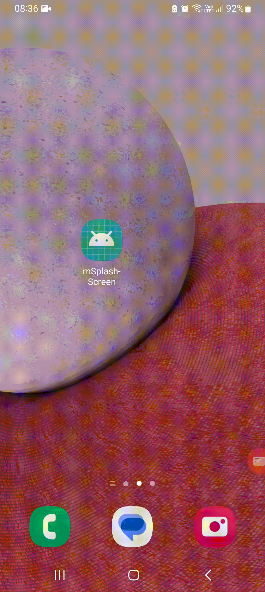

### React Native Splash Screen Example

Learn how to avoid 3 to 5 seconds of black screen during boot up  

## Installation
yarn add react-native-animated-splash-screen

Files edited:
1. App.tsx

## Hide the first default splash screen
2. android\app\src\main\res\values\styles.xml - Edited :9 to :12
> 

3. android\app\src\main\AndroidManifest.xml - Edited :12  
> android:theme="@style/Theme.RemoveSplashScreenTheme"

4. Build_Release_APK.sh

## Run Debug APK on emulator/phone
> yarn android  

For Debug version of APK, upon clicking on your app icon to boot up, you will see a black screen for 3 to 5 seconds on first launch, and then you will see the splash screen immediately.

## Run Release APK on emulator/phone
> source Build_Release_APK.sh

For Release version of APK, upon clicking on your app icon to boot up, you will NOT see a black screen for 3 to 5 seconds on first launch, the app will boot/start up in less than 1 second, and then you will see the splash screen immediately.

## License

Library 'react-native-animated-splash-screen' is licensed under [The MIT License](LICENSE).

## Credits
Regarding main project 'react-native-animated-splash-screen', please refer to 'https://github.com/fabio-alss-freitas/react-native-animated-splash-screen'
